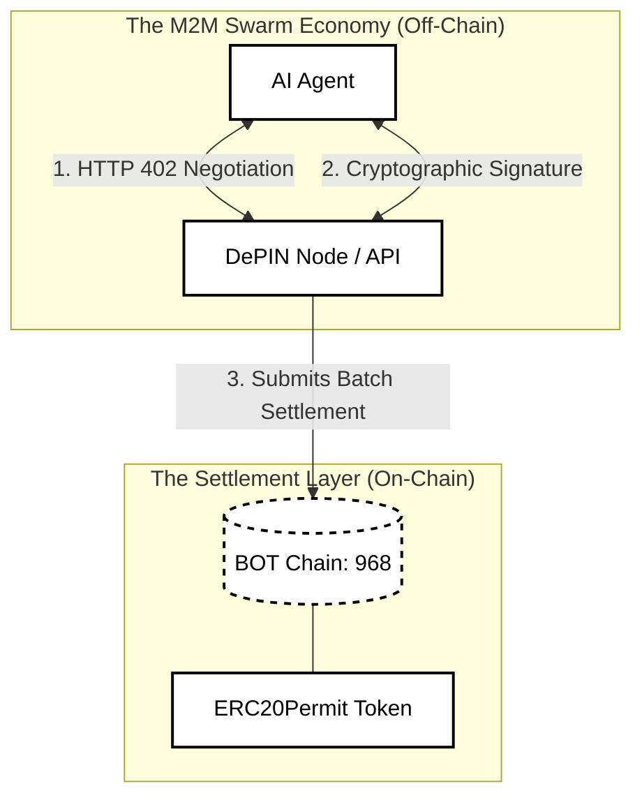
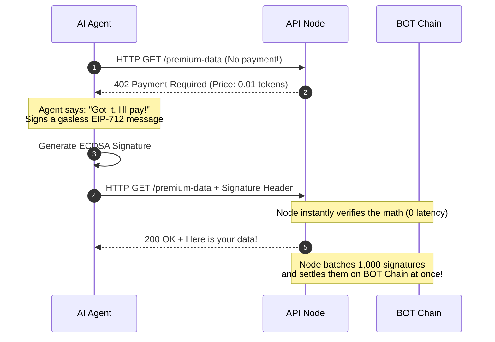

# BOT Chain Ecosystem Proposal: The x402 AI Agent Economy

**Title:** Establishing the x402 Protocol as the Standard for AI Agent API Monetization on BOT Chain  
**Category:** Documentation Improvement & Ecosystem Optimization  
**Target Audience:** BOT Chain Core Developers & AI/DePIN Builders  

---

## 1. The Real-World Problem: AI Agents Don't Have Credit Cards

Here is a fun, factual reality of the modern web: **We are building autonomous AI agents, but forcing them to use human payment rails.** 

If an AI agent wants to fetch live weather data, read a premium news article, or rent a GPU, it hits a paywall. 
* Stripe blocks automated bot transactions. 
* API keys require a human to enter a credit card and sign up for a monthly subscription.
* Traditional on-chain crypto payments (the standard `Approve` + `Transfer` flow) require two separate transactions. For an AI making 1,000 API calls a second, that is incredibly slow and wastes massive amounts of gas.

**The Result:** AI agents are trapped in walled gardens. They can't freely trade with other machines.

## 2. The Solution: HTTP 402 + BOT Chain = Next Gen Swarm Economy

Did you know that when the internet was created in 1989, the founders literally reserved the HTTP status code `402 Payment Required` for future digital cash? For 30 years, it was a joke because the tech didn't exist. 

**Now it does.** The open-source **x402 protocol** uses the `402` status code to allow APIs to instantly challenge an AI agent for a micro-fee.

By combining the **x402 protocol** with **BOT Chain's lightning-fast EVM**, we can build a true Swarm Economy. AI agents can negotiate payments in milliseconds using off-chain EIP-712 cryptographic signatures, settling on the BOT Chain only when necessary!

### The Magic, Visualized (Architecture)



### The Transaction Flow (How it actually works)



---

## 3. The Developer Guide (Let's Build It!)
*We propose adding this simple, fun tutorial to the official BOT Chain Developer Docs.*

### Step 3.1: Deploy an "Agent-Ready" Token
Don't use a boring, standard ERC20. To let AIs pay gaslessly, your token **must** implement `EIP-2612 (ERC20Permit)`. This lets agents sign off-chain checks instead of doing on-chain transactions.

```solidity
// SPDX-License-Identifier: MIT
pragma solidity ^0.8.24;

import "@openzeppelin/contracts/token/ERC20/ERC20.sol";
import "@openzeppelin/contracts/token/ERC20/extensions/ERC20Permit.sol";

// Look mom, no gas fees for approvals! ;)
contract BotChainAgentToken is ERC20, ERC20Permit {
    constructor() ERC20("AI Token", "AIT") ERC20Permit("AI Token") {
        _mint(msg.sender, 1000000 * 10 ** decimals());
    }
}
```

### Step 3.2: Set Up the API Node (The Tollbooth)
Wrap your Node.js API with the x402 middleware. 
*Important:* Because BOT Chain Testnet (`968`) is new, you must explicitly pass the `extra` domain parameters so the agent knows exactly what to sign!

```typescript
import { paymentMiddleware } from "@x402/express";

const routes = {
  "GET /api/market-data": {
    accepts: {
      scheme: "exact",
      price: { amount: "10000", asset: "0xYourTokenAddress" }, // 0.01 tokens!
      network: "eip155:968", // BOT Chain Testnet!
      payTo: "0xProviderWallet...",
      extra: { 
        name: "AI Token", // Must match your smart contract name!
        version: "1" 
      },
    }
  },
};

// Boom. Your API now accepts AI micropayments.
app.use(paymentMiddleware(routes, resourceServer));
```

### Step 3.3: Launch the AI Agent
The agent just uses a wrapped `axios` client. It automatically detects the `402` error, signs the payment using its BOT Chain private key, and gets the data. Zero human interaction required.

```typescript
import { wrapAxiosWithPaymentFromConfig } from "@x402/axios";
import { ExactEvmScheme } from "@x402/evm";
import { privateKeyToAccount } from "viem/accounts";
import axios from "axios";

// 1. Give your agent a BOT Chain wallet
const account = privateKeyToAccount("0x...");
const exactEvmScheme = new ExactEvmScheme(account);

// 2. Wrap axios
const api = wrapAxiosWithPaymentFromConfig(axios.create({ baseURL: "http://api.com" }), {
  schemes: [{ network: "eip155:968", client: exactEvmScheme }],
});

// 3. The agent fetches data. If it hits a 402, it pays automatically :)
const response = await api.get("/api/market-data");
console.log("Got the data!", response.data);
```

---

## 4. The Ecosystem Ask (Optimization Proposal)
We want to make BOT Chain the absolute undisputed king of the AI Swarm Economy. To do that, the developer experience needs to be flawless.

**The Action Item:**
The BOT Chain Core Devs should submit a Pull Request to the open-source `@x402/evm` repository to natively register BOT Chain Mainnet and Testnet (`eip155:968`) into their `DEFAULT_STABLECOINS` registry. 

**Why this matters:**
Right now, developers have to hack the `extra: { name, version }` parameters (as seen in Step 3.2). If BOT Chain is natively registered in the open-source x402 packages, **any AI agent globally will recognize BOT Chain as a native settlement layer out of the box.** 

Let's free the agents and build the real Web3 economy!
