# BOT Chain × x402: The AI Agent Micropayment Standard

> **Establishing x402 as the native Machine-to-Machine (M2M) payment layer for autonomous agents on BOT Chain**

| | |
|---|---|
| **Document Type** | Ecosystem Proposal & Developer Guide |
| **Audience** | BOT Chain Core Developers, AI/DePIN Builders, Agent Framework Authors |
| **Reference Implementation** | [Swarm Broker](.) — live demo of x402 on BOT Chain Testnet |
| **Last Updated** | July 2026 |

---

## Table of Contents

1. [Executive Summary](#1-executive-summary)
2. [The Problem: AI Agents Can't Use Credit Cards](#2-the-problem-ai-agents-cant-use-credit-cards)
3. [What is BOT Chain?](#3-what-is-bot-chain)
4. [What is x402? (Not x403)](#4-what-is-x402-not-x403)
5. [The Swarm Economy Vision](#5-the-swarm-economy-vision)
6. [System Architecture](#6-system-architecture)
7. [Payment Flow: End-to-End](#7-payment-flow-end-to-end)
8. [Cryptographic Layer: EIP-712 & EIP-2612](#8-cryptographic-layer-eip-712--eip-2612)
9. [Swarm Broker Reference Stack](#9-swarm-broker-reference-stack)
10. [Developer Implementation Guide](#10-developer-implementation-guide)
11. [Network Configuration](#11-network-configuration)
12. [Comparison: Payment Models for AI Agents](#12-comparison-payment-models-for-ai-agents)
13. [Ecosystem Optimization Proposal](#13-ecosystem-optimization-proposal)
14. [Roadmap & Future Work](#14-roadmap--future-work)
15. [Resources & Links](#15-resources--links)

---

## 1. Executive Summary

BOT Chain is positioned as the foundational **Layer 1 for AI and DePIN** — a modular algorithmic network where AI agents are first-class on-chain citizens, not off-chain scripts bolted onto Web2 APIs.

To unlock a true **Swarm Economy** — millions of autonomous agents buying compute, data, and API access from each other in real time — agents need a payment primitive that works at machine speed. Credit cards, API keys, and manual subscriptions were designed for humans. Standard on-chain `approve → transferFrom` flows require two transactions per purchase and collapse under high-frequency agent workloads.

**The solution:** [x402](https://www.x402.org) — an open HTTP-native payment protocol (developed by Coinbase, governed by the [x402 Foundation](https://www.x402.org)) that resurrects the long-reserved **HTTP 402 Payment Required** status code. Combined with **EIP-2612 (ERC20Permit)** gasless signatures and BOT Chain's high-throughput EVM, agents can negotiate micropayments in milliseconds off-chain and settle on-chain only when necessary.

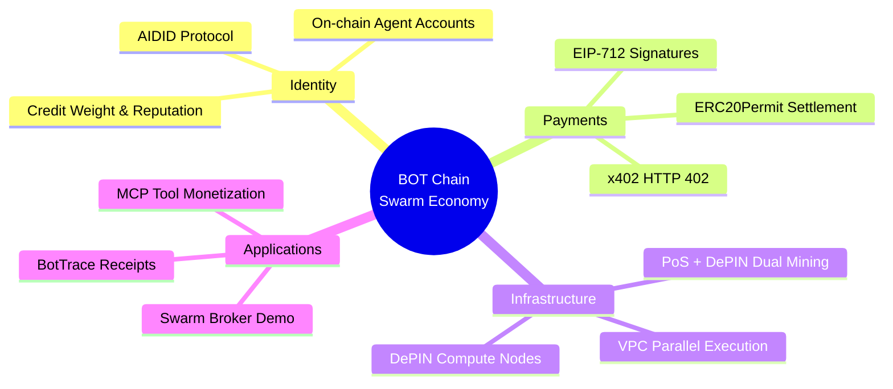
```mermaid
mindmap
  root((BOT Chain<br/>Swarm Economy))
    Identity
      AIDID Protocol
      On-chain Agent Accounts
      Credit Weight & Reputation
    Payments
      x402 HTTP 402
      EIP-712 Signatures
      ERC20Permit Settlement
    Infrastructure
      DePIN Compute Nodes
      PoS + DePIN Dual Mining
      VPC Parallel Execution
    Applications
      Swarm Broker Demo
      BotTrace Receipts
      MCP Tool Monetization
```

**This document proposes** that BOT Chain officially adopt, document, and ecosystem-enable x402 as the canonical M2M payment standard — and that the core team register BOT Chain networks in upstream `@x402/evm` packages so any agent globally recognizes `eip155:968` out of the box.

---

## 2. The Problem: AI Agents Can't Use Credit Cards

The agentic economy is arriving faster than our payment infrastructure can support it. Consider a financial analysis agent that needs to:

- Pull market data every 10 seconds from a DePIN provider
- Query sentiment APIs from three competing nodes
- Rent GPU inference from a compute marketplace
- Pay for each tool call in an MCP (Model Context Protocol) workflow

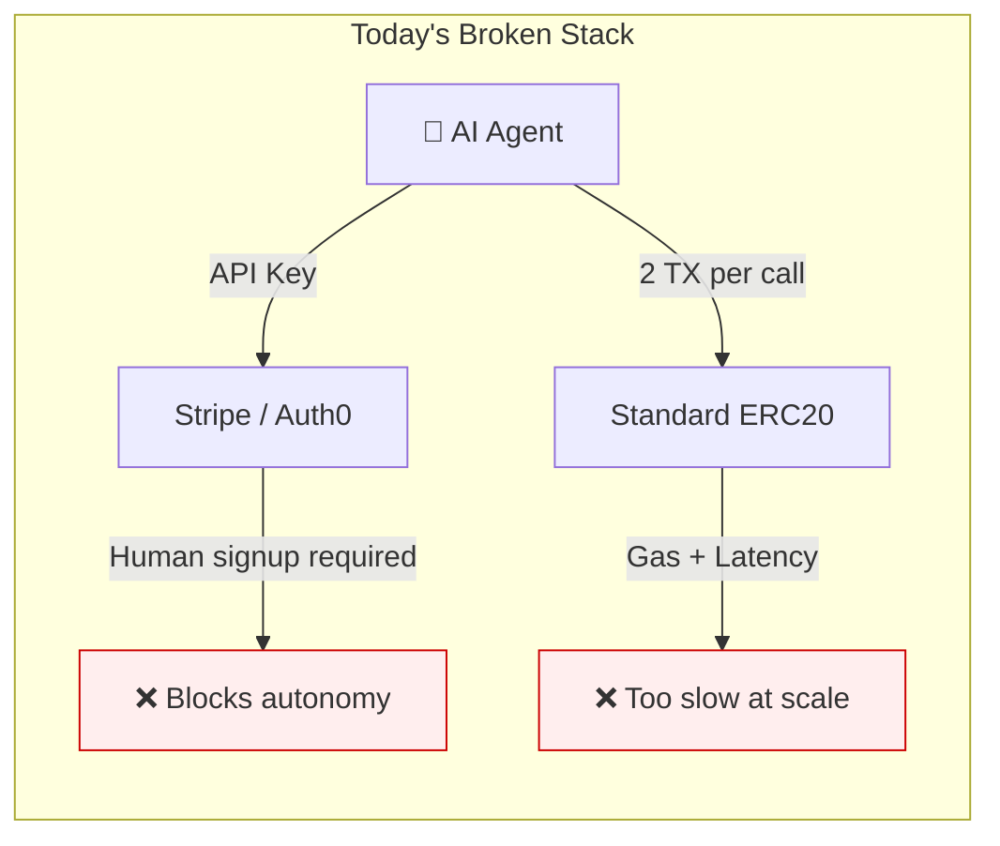
```mermaid
graph LR
    subgraph "Today's Broken Stack"
        A[🤖 AI Agent] -->|API Key| B[Stripe / Auth0]
        A -->|2 TX per call| C[Standard ERC20]
        B -->|Human signup required| D[❌ Blocks autonomy]
        C -->|Gas + Latency| E[❌ Too slow at scale]
    end

    style D fill:#fee,stroke:#c00
    style E fill:#fee,stroke:#c00
```

### Why Existing Models Fail for Agents

| Model | Human UX | Agent UX | Latency | Micropayment Viable? |
|-------|----------|----------|---------|----------------------|
| **Credit Card / Stripe** | ✅ Good | ❌ Impossible — no KYC, no browser | ~2–5s | ❌ $0.30 minimum fee |
| **API Keys** | ✅ Good | ⚠️ Fragile — rotation, revocation, no payment | ~50ms | ❌ Subscription-only |
| **Standard ERC20 Transfer** | ⚠️ OK | ⚠️ Requires wallet UX per TX | ~2–15s | ⚠️ 2 TXs (approve + transfer) |
| **x402 + ERC20Permit** | ✅ Transparent | ✅ Fully autonomous | ~50–200ms | ✅ Sub-cent payments |

### The Scale Problem

An agent making **1,000 API calls per hour** with traditional ERC20 flows:

- **2,000 on-chain transactions** (approve + transferFrom per call)
- **~$5–50 in gas** depending on chain congestion
- **Minutes of cumulative latency** waiting for block confirmations

With x402 on BOT Chain:

- **0 on-chain transactions** during the request/response cycle
- **1 batched settlement** per time window (or deferred settlement)
- **Sub-second API access** with cryptographic payment guarantees

---

## 3. What is BOT Chain?

BOT Chain is an EVM-compatible **modular algorithmic Layer 1** designed for large-scale Web3 applications — particularly AI agents and DePIN (Decentralized Physical Infrastructure) networks.

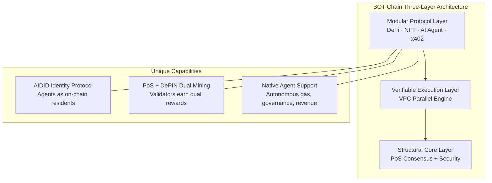
```mermaid
graph TB
    subgraph "BOT Chain Three-Layer Architecture"
        L3["Modular Protocol Layer<br/>DeFi · NFT · AI Agent · x402"]
        L2["Verifiable Execution Layer<br/>VPC Parallel Engine"]
        L1["Structural Core Layer<br/>PoS Consensus + Security"]
    end

    L3 --> L2 --> L1

    subgraph "Unique Capabilities"
        AIDID["AIDID Identity Protocol<br/>Agents as on-chain residents"]
        DUAL["PoS + DePIN Dual Mining<br/>Validators earn dual rewards"]
        AGENT["Native Agent Support<br/>Autonomous gas, governance, revenue"]
    end

    L3 --- AIDID
    L3 --- DUAL
    L3 --- AGENT
```

### Key Differentiators

| Feature | Description |
|---------|-------------|
| **AIDID Protocol** | AI agents get native on-chain identity — independent accounts, credit weight, and value settlement capability |
| **PoS + DePIN Dual Mining** | Validator nodes participate in consensus *and* contribute GPU/CPU/storage, earning dual rewards |
| **Modular Protocol Layer** | DeFi, NFT, and AI Agent functionality shipped as standard modules — build without writing contracts from scratch |
| **VPC Parallel Engine** | Proprietary verifiable parallel execution for high-throughput agent workloads |
| **EVM Compatibility** | Full Ethereum tooling support — Hardhat, viem, OpenZeppelin, x402 SDKs |

### Network Identifiers

| Network | Chain ID | CAIP-2 Identifier | RPC | Explorer |
|---------|----------|-------------------|-----|----------|
| **BOT Chain Testnet** | `968` | `eip155:968` | `https://rpc.bohr.life` | `https://scan.bohr.life` |
| **BOT Chain Mainnet** | TBD | `eip155:<mainnet>` | TBD | TBD |

> **Native Token:** BOT — used for gas fees. Settlement for x402 micropayments uses stablecoins (MockUSDC on testnet, canonical USDC on mainnet).

---

## 4. What is x402? (Not x403)

> **Important:** The protocol is **x402**, named after **HTTP status code 402** ("Payment Required"). This is distinct from HTTP 403 ("Forbidden") — x403 is not a payment protocol. When you see "x402" referenced throughout this ecosystem, it refers to the [x402 open payment standard](https://docs.cdp.coinbase.com/x402/welcome).

### Origin & Governance

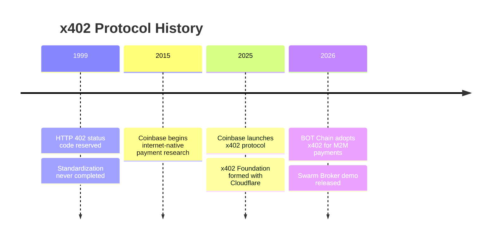
```mermaid
timeline
    title x402 Protocol History
    1999 : HTTP 402 status code reserved : Standardization never completed
    2015 : Coinbase begins internet-native payment research
    2025 : Coinbase launches x402 protocol : x402 Foundation formed with Cloudflare
    2026 : BOT Chain adopts x402 for M2M payments : Swarm Broker demo released
```

### Core Concept

x402 embeds payment negotiation directly into HTTP — the same transport layer agents already use to fetch data. No new protocols, no custom SDKs required beyond a thin middleware wrapper.

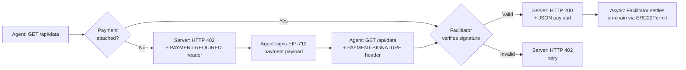
```mermaid
flowchart LR
    REQ["Agent: GET /api/data"] --> CHECK{Payment<br/>attached?}
    CHECK -->|No| RESP402["Server: HTTP 402<br/>+ PAYMENT-REQUIRED header"]
    CHECK -->|Yes| VERIFY{Facilitator<br/>verifies signature}
    RESP402 --> SIGN["Agent signs EIP-712<br/>payment payload"]
    SIGN --> RETRY["Agent: GET /api/data<br/>+ PAYMENT-SIGNATURE header"]
    RETRY --> VERIFY
    VERIFY -->|Valid| SERVE["Server: HTTP 200<br/>+ JSON payload"]
    VERIFY -->|Invalid| REJECT["Server: HTTP 402<br/>retry"]
    SERVE --> SETTLE["Async: Facilitator settles<br/>on-chain via ERC20Permit"]
```

### Protocol Actors

| Actor | Role | Example in Swarm Broker |
|-------|------|-------------------------|
| **Client (Buyer)** | AI agent or app that pays for resources | `@swarm/agent-client` |
| **Resource Server (Seller)** | API provider that monetizes endpoints | `@swarm/provider-node` |
| **Facilitator** | Verifies signatures off-chain, submits on-chain settlement | `facilitator.x402.org` (or self-hosted) |
| **Settlement Token** | ERC20 with Permit support for gasless approvals | `MockUSDC` on BOT Chain Testnet |

### Payment Schemes

| Scheme | Behavior | Best For |
|--------|----------|----------|
| **`exact`** | Fixed price per request; pay exactly the stated amount | API calls, data feeds, MCP tool invocations |
| **`deferred`** | Accumulate charges; settle in batches | High-frequency trading bots, streaming data |
| **Multi-network** | Accept EVM + Solana + others in same endpoint | Cross-chain agent swarms |

Swarm Broker uses the **`exact`** scheme — 0.01 USDC per `/api/market-data` request.

### HTTP Headers (v2 Protocol)

| Header | Direction | Contents |
|--------|-----------|----------|
| `PAYMENT-REQUIRED` | Server → Client | Base64-encoded payment requirements (price, token, network, payTo) |
| `PAYMENT-SIGNATURE` | Client → Server | Base64-encoded signed payment payload (EIP-712) |
| `PAYMENT-RESPONSE` | Server → Client | Base64-encoded settlement confirmation (tx hash) |

Legacy v1 headers (`X-PAYMENT`, `X-PAYMENT-RESPONSE`) are also supported for backward compatibility.

---

## 5. The Swarm Economy Vision

The **Swarm Economy** is BOT Chain's vision for machine-to-machine commerce at scale — a network where autonomous agents are economic participants, not just API consumers.

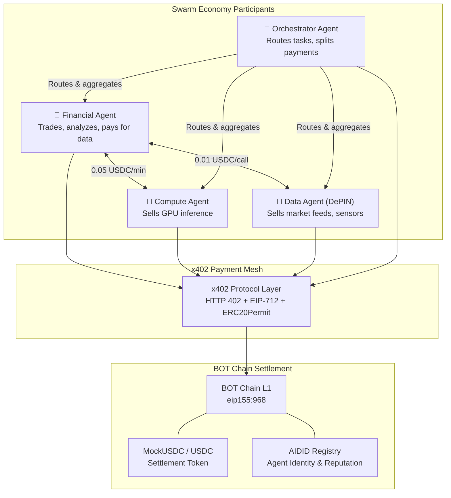
```mermaid
graph TB
    subgraph "Swarm Economy Participants"
        FA["🤖 Financial Agent<br/>Trades, analyzes, pays for data"]
        CA["🧠 Compute Agent<br/>Sells GPU inference"]
        DA["📡 Data Agent (DePIN)<br/>Sells market feeds, sensors"]
        OA["🔧 Orchestrator Agent<br/>Routes tasks, splits payments"]
    end

    subgraph "x402 Payment Mesh"
        X402["x402 Protocol Layer<br/>HTTP 402 + EIP-712 + ERC20Permit"]
    end

    subgraph "BOT Chain Settlement"
        BC["BOT Chain L1<br/>eip155:968"]
        USDC["MockUSDC / USDC<br/>Settlement Token"]
        AIDID["AIDID Registry<br/>Agent Identity & Reputation"]
    end

    FA <-->|"0.01 USDC/call"| DA
    FA <-->|"0.05 USDC/min"| CA
    OA -->|"Routes & aggregates"| FA
    OA -->|"Routes & aggregates"| CA
    OA -->|"Routes & aggregates"| DA

    FA & CA & DA & OA --> X402
    X402 --> BC
    BC --- USDC
    BC --- AIDID
```

### Swarm Broker: Reference Implementation

This repository (`swarm-broker`) is a working demonstration of the Swarm Economy thesis:

| Component | Package | Purpose |
|-----------|---------|---------|
| **Agent Client** | `@swarm/agent-client` | Autonomous AI agent that fetches paid market data via x402 |
| **Provider Node** | `@swarm/provider-node` | DePIN data provider that monetizes `/api/market-data` at 0.01 USDC/request |
| **Frontend Dashboard** | `@swarm/frontend` | Real-time visualization of 402 challenges, signatures, and settlements |
| **Settlement Token** | `@swarm/contracts` | `MockUSDC` — ERC20Permit token deployed on BOT Chain Testnet |
| **Shared Artifacts** | `shared/` | Contract ABIs and deployment addresses |

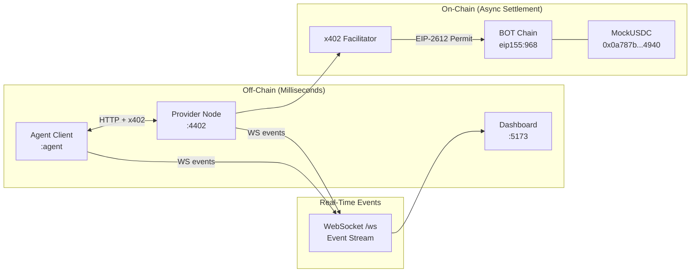
```mermaid
graph LR
    subgraph "Off-Chain (Milliseconds)"
        AGENT["Agent Client<br/>:agent"]
        PROVIDER["Provider Node<br/>:4402"]
        FRONTEND["Dashboard<br/>:5173"]
    end

    subgraph "Real-Time Events"
        WS["WebSocket /ws<br/>Event Stream"]
    end

    subgraph "On-Chain (Async Settlement)"
        FACILITATOR["x402 Facilitator"]
        BOTCHAIN["BOT Chain<br/>eip155:968"]
        TOKEN["MockUSDC<br/>0x0a787b...4940"]
    end

    AGENT <-->|"HTTP + x402"| PROVIDER
    AGENT -->|"WS events"| WS
    PROVIDER -->|"WS events"| WS
    WS --> FRONTEND
    PROVIDER --> FACILITATOR
    FACILITATOR -->|"EIP-2612 Permit"| BOTCHAIN
    BOTCHAIN --- TOKEN
```

---

## 6. System Architecture

### High-Level Architecture

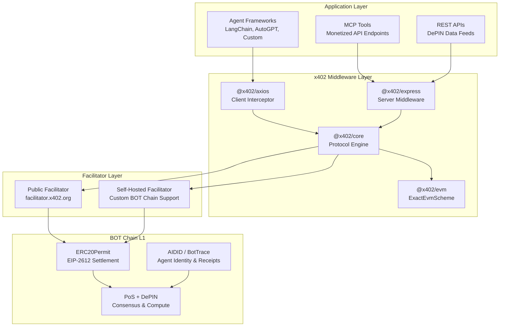
```mermaid
graph TD
    subgraph "Application Layer"
        MCP["MCP Tools<br/>Monetized API Endpoints"]
        REST["REST APIs<br/>DePIN Data Feeds"]
        AGENT_FW["Agent Frameworks<br/>LangChain, AutoGPT, Custom"]
    end

    subgraph "x402 Middleware Layer"
        AXIOX["@x402/axios<br/>Client Interceptor"]
        EXPRESS["@x402/express<br/>Server Middleware"]
        CORE["@x402/core<br/>Protocol Engine"]
        EVM["@x402/evm<br/>ExactEvmScheme"]
    end

    subgraph "Facilitator Layer"
        PUB_FAC["Public Facilitator<br/>facilitator.x402.org"]
        SELF_FAC["Self-Hosted Facilitator<br/>Custom BOT Chain Support"]
    end

    subgraph "BOT Chain L1"
        PERMIT["ERC20Permit<br/>EIP-2612 Settlement"]
        REGISTRY["AIDID / BotTrace<br/>Agent Identity & Receipts"]
        CONSENSUS["PoS + DePIN<br/>Consensus & Compute"]
    end

    AGENT_FW --> AXIOX
    MCP & REST --> EXPRESS
    AXIOX --> CORE
    EXPRESS --> CORE
    CORE --> EVM
    CORE --> PUB_FAC & SELF_FAC
    PUB_FAC & SELF_FAC --> PERMIT
    PERMIT --> CONSENSUS
    REGISTRY --> CONSENSUS
```

### Package Dependency Graph

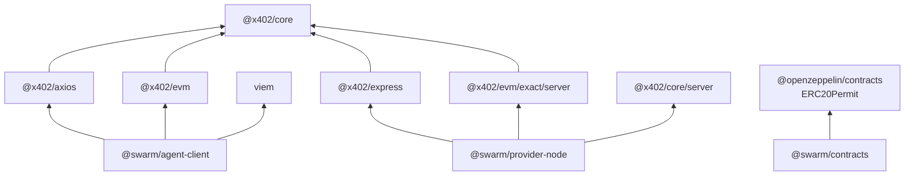
```mermaid
graph BT
    AGENT["@swarm/agent-client"]
    PROVIDER["@swarm/provider-node"]
    CONTRACTS["@swarm/contracts"]

    AGENT --> AXIOS_PKG["@x402/axios"]
    AGENT --> EVM_CLIENT["@x402/evm"]
    AGENT --> VIEM["viem"]

    PROVIDER --> EXPRESS_PKG["@x402/express"]
    PROVIDER --> EVM_SERVER["@x402/evm/exact/server"]
    PROVIDER --> CORE_SERVER["@x402/core/server"]

    AXIOS_PKG --> CORE["@x402/core"]
    EXPRESS_PKG --> CORE
    EVM_CLIENT --> CORE
    EVM_SERVER --> CORE

    CONTRACTS --> OZ["@openzeppelin/contracts<br/>ERC20Permit"]
```

---

## 7. Payment Flow: End-to-End

### Sequence Diagram: Single API Call

How an AI agent instantly buys data without paying upfront gas:

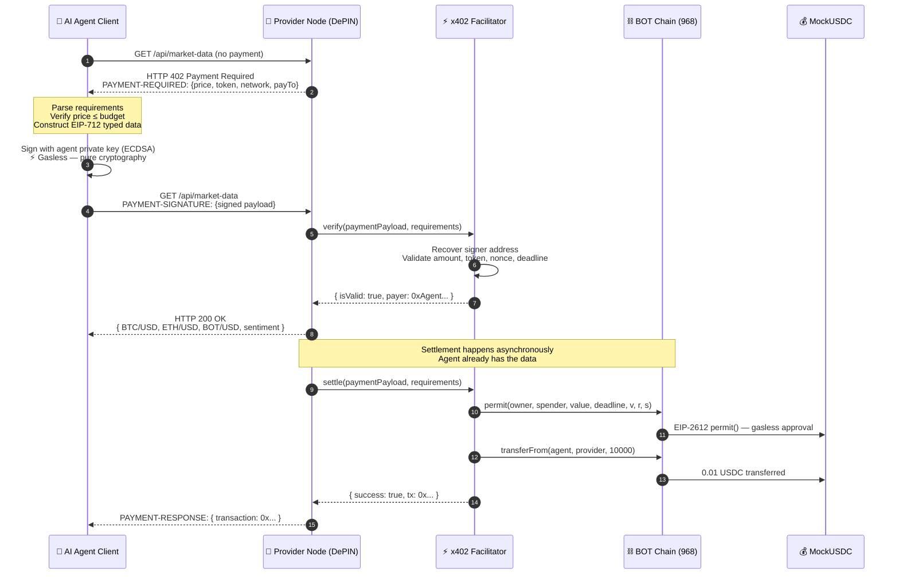
```mermaid
sequenceDiagram
    autonumber
    participant Agent as 🤖 AI Agent Client
    participant Node as 📡 Provider Node (DePIN)
    participant Fac as ⚡ x402 Facilitator
    participant Chain as ⛓️ BOT Chain (968)
    participant Token as 💰 MockUSDC

    Agent->>Node: GET /api/market-data (no payment)
    Node-->>Agent: HTTP 402 Payment Required<br/>PAYMENT-REQUIRED: {price, token, network, payTo}

    Note over Agent: Parse requirements<br/>Verify price ≤ budget<br/>Construct EIP-712 typed data

    Agent->>Agent: Sign with agent private key (ECDSA)<br/>⚡ Gasless — pure cryptography

    Agent->>Node: GET /api/market-data<br/>PAYMENT-SIGNATURE: {signed payload}

    Node->>Fac: verify(paymentPayload, requirements)
    Fac->>Fac: Recover signer address<br/>Validate amount, token, nonce, deadline
    Fac-->>Node: { isValid: true, payer: 0xAgent... }

    Node-->>Agent: HTTP 200 OK<br/>{ BTC/USD, ETH/USD, BOT/USD, sentiment }

    Note over Node,Chain: Settlement happens asynchronously<br/>Agent already has the data

    Node->>Fac: settle(paymentPayload, requirements)
    Fac->>Chain: permit(owner, spender, value, deadline, v, r, s)
    Chain->>Token: EIP-2612 permit() — gasless approval
    Fac->>Chain: transferFrom(agent, provider, 10000)
    Chain->>Token: 0.01 USDC transferred
    Fac-->>Node: { success: true, tx: 0x... }
    Node-->>Agent: PAYMENT-RESPONSE: { transaction: 0x... }
```

### State Machine: Agent Payment Lifecycle

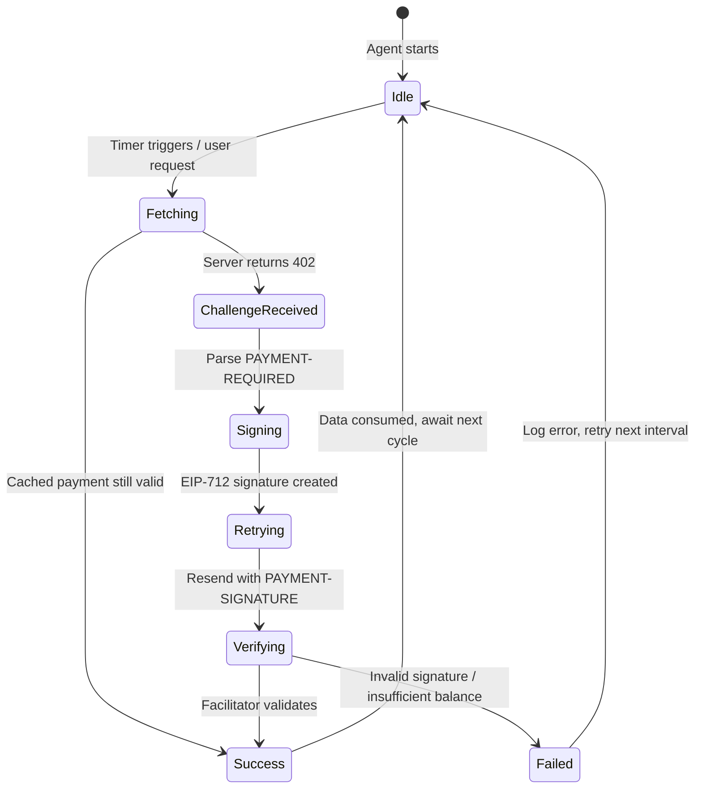
```mermaid
stateDiagram-v2
    [*] --> Idle: Agent starts
    Idle --> Fetching: Timer triggers / user request
    Fetching --> ChallengeReceived: Server returns 402
    Fetching --> Success: Cached payment still valid
    ChallengeReceived --> Signing: Parse PAYMENT-REQUIRED
    Signing --> Retrying: EIP-712 signature created
    Retrying --> Verifying: Resend with PAYMENT-SIGNATURE
    Verifying --> Success: Facilitator validates
    Verifying --> Failed: Invalid signature / insufficient balance
    Success --> Idle: Data consumed, await next cycle
    Failed --> Idle: Log error, retry next interval
```

### WebSocket Event Stream (Swarm Broker Dashboard)

The reference implementation broadcasts real-time events over WebSocket for observability:

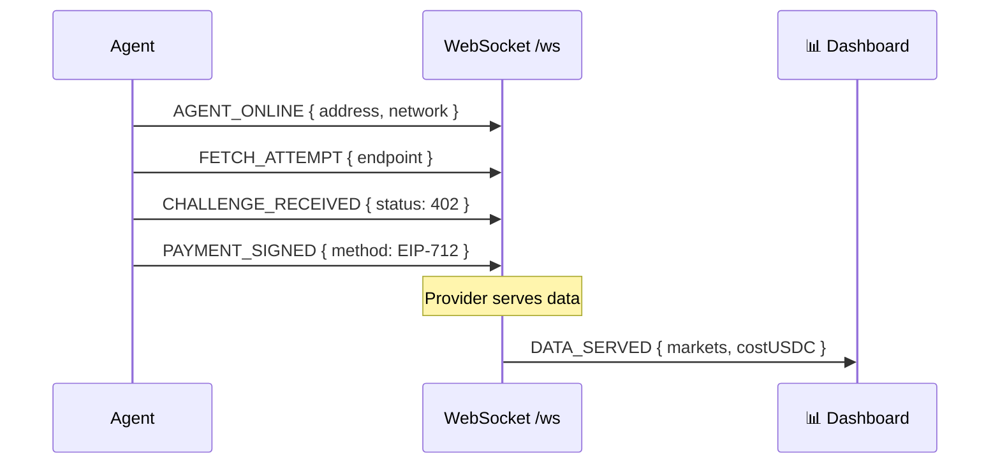
```mermaid
sequenceDiagram
    participant Agent
    participant WS as WebSocket /ws
    participant Frontend as 📊 Dashboard

    Agent->>WS: AGENT_ONLINE { address, network }
    Agent->>WS: FETCH_ATTEMPT { endpoint }
    Agent->>WS: CHALLENGE_RECEIVED { status: 402 }
    Agent->>WS: PAYMENT_SIGNED { method: EIP-712 }
    Note over WS: Provider serves data
    WS->>Frontend: DATA_SERVED { markets, costUSDC }
```

| Event Type | Source | Meaning |
|------------|--------|---------|
| `AGENT_ONLINE` | Agent | Agent connected with wallet address |
| `FETCH_ATTEMPT` | Agent | Requesting protected endpoint |
| `CHALLENGE_RECEIVED` | Agent | Got HTTP 402, beginning payment flow |
| `PAYMENT_SIGNED` | Agent | EIP-712 signature generated |
| `DATA_SERVED` | Provider | Payment verified, data delivered |
| `PROVIDER_ONLINE` | Provider | DePIN node started |

---

## 8. Cryptographic Layer: EIP-712 & EIP-2612

x402's speed advantage comes from doing payment authorization **off-chain** via typed structured data signatures, then settling **on-chain** asynchronously via gasless permits.

### EIP-712: Off-Chain Payment Authorization

EIP-712 allows agents to sign human-readable, structured messages that are verifiable on-chain:

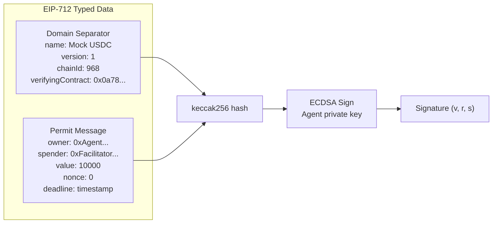
```mermaid
graph LR
    subgraph "EIP-712 Typed Data"
        DOMAIN["Domain Separator<br/>name: Mock USDC<br/>version: 1<br/>chainId: 968<br/>verifyingContract: 0x0a78..."]
        MESSAGE["Permit Message<br/>owner: 0xAgent...<br/>spender: 0xFacilitator...<br/>value: 10000<br/>nonce: 0<br/>deadline: timestamp"]
    end

    DOMAIN --> HASH["keccak256 hash"]
    MESSAGE --> HASH
    HASH --> SIGN["ECDSA Sign<br/>Agent private key"]
    SIGN --> SIG["Signature (v, r, s)"]
```

**Why this matters for agents:**
- Signing is **pure cryptography** — no RPC call, no gas, no block time
- Takes **~1ms** on modern hardware
- Signature is **binding** — facilitator can enforce payment on-chain later
- **Non-repudiation** — agent cannot deny authorizing the payment

### EIP-2612: Gasless On-Chain Settlement

Traditional ERC20 requires two transactions (`approve` + `transferFrom`). EIP-2612 (`ERC20Permit`) collapses approval into the signature:

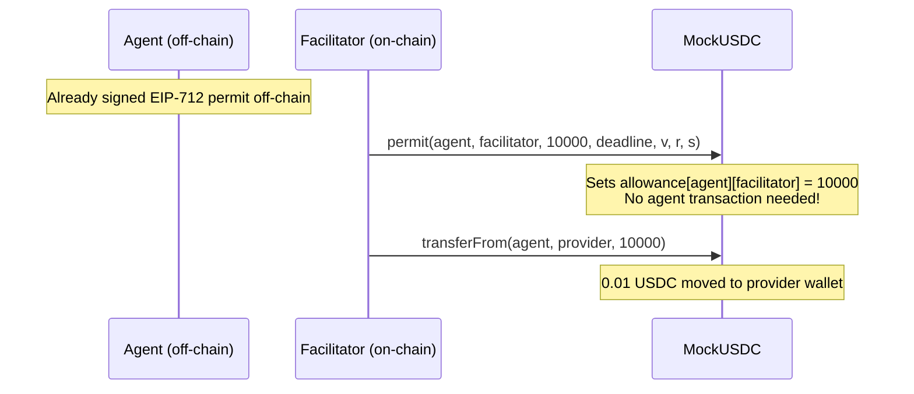
```mermaid
sequenceDiagram
    participant Agent as Agent (off-chain)
    participant Fac as Facilitator (on-chain)
    participant Token as MockUSDC

    Note over Agent: Already signed EIP-712 permit off-chain

    Fac->>Token: permit(agent, facilitator, 10000, deadline, v, r, s)
    Note over Token: Sets allowance[agent][facilitator] = 10000<br/>No agent transaction needed!

    Fac->>Token: transferFrom(agent, provider, 10000)
    Note over Token: 0.01 USDC moved to provider wallet
```

### Why Tokens Must Implement ERC20Permit

```solidity
// ❌ Standard ERC20 — requires agent to send approve() TX
contract BadToken is ERC20 { }

// ✅ Agent-ready token — gasless approval via signature
contract MockUSDC is ERC20, ERC20Permit, ERC20Burnable, Ownable {
    // EIP-2612 permit() inherited from ERC20Permit
    // 6 decimals to match real USDC
}
```

> **Deployed on BOT Chain Testnet:** `MockUSDC` at `0x0a787b1BDeD316ff833113be958Dcd1dF9654940` — see [`deployment.json`](./deployment.json).

---

## 9. Swarm Broker Reference Stack

### Repository Structure

```
swarm/
├── apps/
│   ├── agent-client/       # Autonomous x402-paying agent
│   ├── provider-node/      # DePIN API gateway with x402 middleware
│   ├── frontend/           # Real-time payment flow dashboard
│   └── contracts/          # MockUSDC (ERC20Permit) + deploy scripts
├── shared/
│   └── MockUSDC.json       # Contract ABI
├── deployment.json         # Deployed contract addresses
├── .env.example            # Environment template
└── BOT_CHAIN_X402_PROPOSAL.md  # This document
```

### Deployed Contracts (Testnet)

| Contract | Address | Decimals |
|----------|---------|----------|
| **MockUSDC** | `0x0a787b1BDeD316ff833113be958Dcd1dF9654940` | 6 |
| **Deployer** | `0x18AF72239dD6a52426e4dd9509C6515Df06477E4` | — |
| **Network** | BOT Chain Testnet (`eip155:968`) | — |

### Quick Start

```bash
# 1. Install dependencies
pnpm install

# 2. Configure environment
cp .env.example .env
# Fill in PRIVATE_KEY, MOCK_USDC_ADDRESS, PROVIDER_WALLET_ADDRESS

# 3. Compile & deploy contracts (if not already deployed)
pnpm contracts:compile
pnpm contracts:deploy

# 4. Start all services (separate terminals)
pnpm provider:dev      # Provider node on :4402
pnpm agent:run         # Agent client (polls every 10s)
pnpm frontend:dev      # Dashboard on :5173
```

### Environment Variables

| Variable | Description | Example |
|----------|-------------|---------|
| `BOT_CHAIN_RPC_URL` | JSON-RPC endpoint | `https://rpc.bohr.life` |
| `BOT_CHAIN_ID` | Chain ID | `968` |
| `PRIVATE_KEY` | Agent/deployer wallet | `0x...` |
| `MOCK_USDC_ADDRESS` | Settlement token | `0x0a787b1BDeD316ff833113be958Dcd1dF9654940` |
| `PROVIDER_WALLET_ADDRESS` | Provider's receiving wallet | `0x...` |
| `PROVIDER_URL` | Agent's target API | `http://localhost:4402` |
| `FACILITATOR_URL` | x402 facilitator service | `https://facilitator.x402.org` |

---

## 10. Developer Implementation Guide

### Step 1: Deploy an Agent-Ready Token (ERC20Permit)

Do not use standard ERC20. Agents require `EIP-2612 (ERC20Permit)` for gasless off-chain approvals.

```solidity
// SPDX-License-Identifier: MIT
pragma solidity ^0.8.24;

import "@openzeppelin/contracts/token/ERC20/ERC20.sol";
import "@openzeppelin/contracts/token/ERC20/extensions/ERC20Permit.sol";
import "@openzeppelin/contracts/token/ERC20/extensions/ERC20Burnable.sol";
import "@openzeppelin/contracts/access/Ownable.sol";

/**
 * @title MockUSDC
 * @notice Settlement currency for x402 micropayments on BOT Chain.
 * @dev 6 decimals (matches real USDC). Includes faucet for testnet agents.
 */
contract MockUSDC is ERC20, ERC20Burnable, ERC20Permit, Ownable {
    uint8 private constant _DECIMALS = 6;

    constructor(address initialOwner)
        ERC20("Mock USDC", "USDC")
        ERC20Permit("Mock USDC")
        Ownable(initialOwner)
    {
        _mint(initialOwner, 1_000_000 * 10 ** _DECIMALS);
    }

    function decimals() public pure override returns (uint8) {
        return _DECIMALS;
    }

    /// @notice Fund agent wallets during development
    function faucet() external {
        _mint(msg.sender, 1_000 * 10 ** _DECIMALS);
    }
}
```

Deploy to BOT Chain Testnet:

```bash
pnpm contracts:deploy
# Updates deployment.json with contract address
```

### Step 2: Configure the Provider Node (DePIN Seller)

The API gateway intercepts requests and issues HTTP 402 challenges. The `@x402/express` middleware handles the entire payment lifecycle.

```typescript
import { paymentMiddleware, x402ResourceServer } from "@x402/express";
import { ExactEvmScheme } from "@x402/evm/exact/server";
import { HTTPFacilitatorClient } from "@x402/core/server";

const BOT_CHAIN_ID = "968";
const NETWORK = `eip155:${BOT_CHAIN_ID}`;

const facilitatorClient = new HTTPFacilitatorClient({
  url: process.env.FACILITATOR_URL || "https://facilitator.x402.org",
});

const resourceServer = new x402ResourceServer(facilitatorClient).register(
  NETWORK,
  new ExactEvmScheme()
);

const routes = {
  "GET /api/market-data": {
    accepts: {
      scheme: "exact" as const,
      price: { amount: "10000", asset: "0x0a787b1BDeD316ff833113be958Dcd1dF9654940" },
      network: NETWORK,
      payTo: process.env.PROVIDER_WALLET_ADDRESS,
      // Required until BOT Chain is in @x402/evm DEFAULT_STABLECOINS
      extra: { name: "Mock USDC", version: "1" },
    },
    description: "Real-time financial market data feed — AI agent endpoint",
  },
};

app.use(paymentMiddleware(routes, resourceServer));
```

#### Provider Architecture

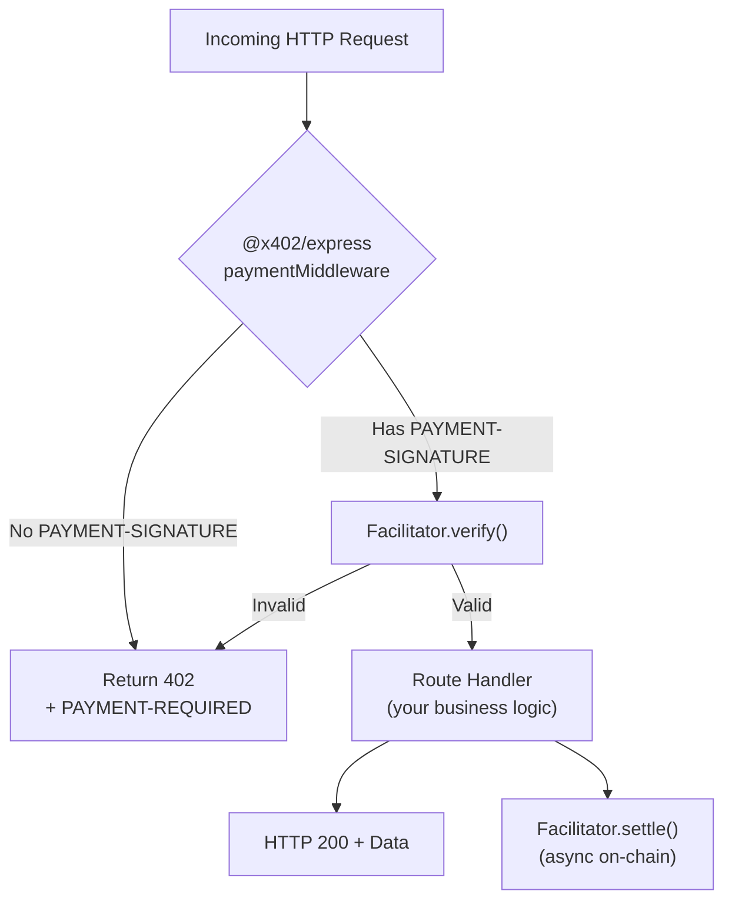
```mermaid
flowchart TD
    REQ["Incoming HTTP Request"] --> MW{"@x402/express<br/>paymentMiddleware"}
    MW -->|"No PAYMENT-SIGNATURE"| CHALLENGE["Return 402<br/>+ PAYMENT-REQUIRED"]
    MW -->|"Has PAYMENT-SIGNATURE"| FAC["Facilitator.verify()"]
    FAC -->|"Invalid"| CHALLENGE
    FAC -->|"Valid"| HANDLER["Route Handler<br/>(your business logic)"]
    HANDLER --> RESP["HTTP 200 + Data"]
    HANDLER --> SETTLE["Facilitator.settle()<br/>(async on-chain)"]
```

> **Hackathon Note:** The public facilitator at `facilitator.x402.org` does not yet natively support `eip155:968`. Swarm Broker includes a local facilitator mock that verifies signatures and simulates settlement. See [Ecosystem Optimization Proposal](#13-ecosystem-optimization-proposal).

### Step 3: Configure the AI Agent Client (Buyer)

The agent wraps standard HTTP libraries with the x402 interceptor. Payment negotiation is fully automatic.

```typescript
import axios from "axios";
import { wrapAxiosWithPaymentFromConfig } from "@x402/axios";
import { ExactEvmScheme } from "@x402/evm";
import { privateKeyToAccount } from "viem/accounts";

const BOT_CHAIN_ID = "968";
const NETWORK = `eip155:${BOT_CHAIN_ID}` as `${string}:${string}`;

const account = privateKeyToAccount(process.env.PRIVATE_KEY as `0x${string}`);
const exactEvmScheme = new ExactEvmScheme(account);

const api = wrapAxiosWithPaymentFromConfig(
  axios.create({ baseURL: "http://localhost:4402" }),
  {
    schemes: [{ network: NETWORK, client: exactEvmScheme }],
  }
);

// The wrapper handles 402 challenge → sign → retry automatically
const response = await api.get("/api/market-data");
console.log(response.data.markets["BTC/USD"].price);
```

#### Agent Decision Flow

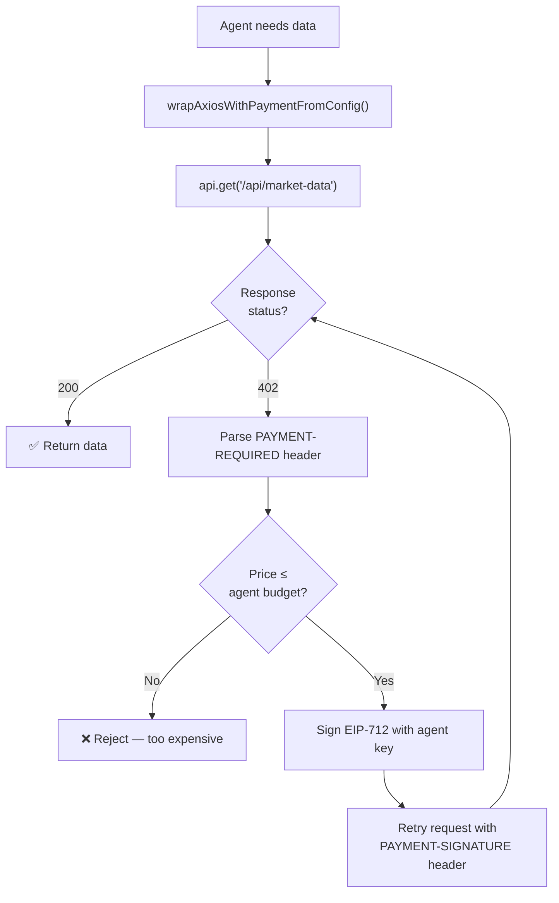
```mermaid
flowchart TD
    START["Agent needs data"] --> WRAP["wrapAxiosWithPaymentFromConfig()"]
    WRAP --> REQUEST["api.get('/api/market-data')"]
    REQUEST --> CHECK402{"Response<br/>status?"}
    CHECK402 -->|"200"| DONE["✅ Return data"]
    CHECK402 -->|"402"| PARSE["Parse PAYMENT-REQUIRED header"]
    PARSE --> BUDGET{"Price ≤<br/>agent budget?"}
    BUDGET -->|"No"| ABORT["❌ Reject — too expensive"]
    BUDGET -->|"Yes"| SIGN["Sign EIP-712 with agent key"]
    SIGN --> RETRY["Retry request with<br/>PAYMENT-SIGNATURE header"]
    RETRY --> CHECK402
```

### Step 4: Add MCP Tool Monetization (Optional)

x402 integrates naturally with the Model Context Protocol — each MCP tool call can be a paid API endpoint:

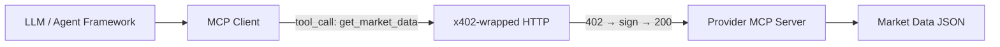
```mermaid
graph LR
    LLM["LLM / Agent Framework"] --> MCP["MCP Client"]
    MCP -->|"tool_call: get_market_data"| X402["x402-wrapped HTTP"]
    X402 -->|"402 → sign → 200"| PROVIDER["Provider MCP Server"]
    PROVIDER --> DATA["Market Data JSON"]
```

This enables agents to autonomously discover, price-compare, and purchase tools without human-in-the-loop payment approval.

---

## 11. Network Configuration

### Add BOT Chain Testnet to MetaMask

| Field | Value |
|-------|-------|
| **Network Name** | BOT Chain Testnet |
| **RPC URL** | `https://rpc.bohr.life` |
| **Chain ID** | `968` |
| **Currency Symbol** | BOT |
| **Block Explorer** | `https://scan.bohr.life` |

### Fund Your Agent Wallet

```bash
# Option 1: MockUSDC faucet (1,000 USDC per hour)
cast send 0x0a787b1BDeD316ff833113be958Dcd1dF9654940 \
  "faucet()" \
  --rpc-url https://rpc.bohr.life \
  --private-key $PRIVATE_KEY

# Option 2: Deployer mint (owner only)
cast send 0x0a787b1BDeD316ff833113be958Dcd1dF9654940 \
  "mint(address,uint256)" $AGENT_ADDRESS 1000000000 \
  --rpc-url https://rpc.bohr.life \
  --private-key $DEPLOYER_KEY
```

### CAIP-2 Network Identifier

All x402 configuration uses CAIP-2 format for chain identification:

```
eip155:968    → BOT Chain Testnet
eip155:<id>   → BOT Chain Mainnet (TBD)
```

This is the industry-standard identifier used across x402, WalletConnect, and multichain SDKs.

---

## 12. Comparison: Payment Models for AI Agents

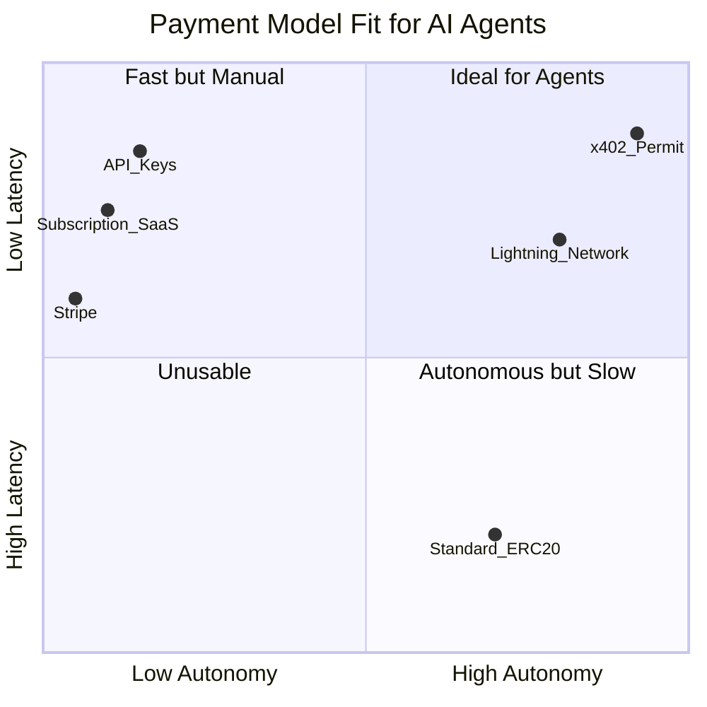
```mermaid
quadrantChart
    title Payment Model Fit for AI Agents
    x-axis Low Autonomy --> High Autonomy
    y-axis High Latency --> Low Latency
    quadrant-1 Ideal for Agents
    quadrant-2 Fast but Manual
    quadrant-3 Unusable
    quadrant-4 Autonomous but Slow
    x402_Permit: [0.92, 0.88]
    API_Keys: [0.15, 0.85]
    Stripe: [0.05, 0.60]
    Standard_ERC20: [0.70, 0.20]
    Subscription_SaaS: [0.10, 0.75]
    Lightning_Network: [0.80, 0.70]
```

> **Chart key:** `x402_Permit` = x402 + ERC20Permit · `Subscription_SaaS` = Subscription SaaS · `Lightning_Network` = Lightning Network

| Criteria | API Keys | Stripe | Standard ERC20 | **x402 + Permit** |
|----------|----------|--------|----------------|-------------------|
| Agent-autonomous | ❌ | ❌ | ⚠️ | ✅ |
| Per-request billing | ❌ | ⚠️ | ✅ | ✅ |
| Sub-cent payments | ❌ | ❌ | ⚠️ | ✅ |
| No upfront gas | ✅ | ✅ | ❌ | ✅ |
| Cryptographic proof | ❌ | ❌ | ✅ | ✅ |
| HTTP-native | ✅ | ❌ | ❌ | ✅ |
| Batch settlement | N/A | N/A | ❌ | ✅ |
| Identity/reputation | ❌ | ❌ | ⚠️ | ✅ (via AIDID) |

---

## 13. Ecosystem Optimization Proposal

To make BOT Chain the undisputed home of AI agent commerce, three ecosystem-level actions are needed:

### Action 1: Register BOT Chain in `@x402/evm`

**Problem:** The public x402 facilitator and SDK default registries do not include `eip155:968`. Developers must manually inject `extra: { name, version }` overrides for EIP-712 domain parameters.

**Proposal:** BOT Chain Core Team submits a PR to [`@x402/evm`](https://github.com/x402-foundation/x402) adding:

```typescript
// Proposed addition to DEFAULT_STABLECOINS
{
  "eip155:968": {
    USDC: {
      address: "0x0a787b1BDeD316ff833113be958Dcd1dF9654940",
      decimals: 6,
      eip712: { name: "Mock USDC", version: "1" },
    },
  },
}
```

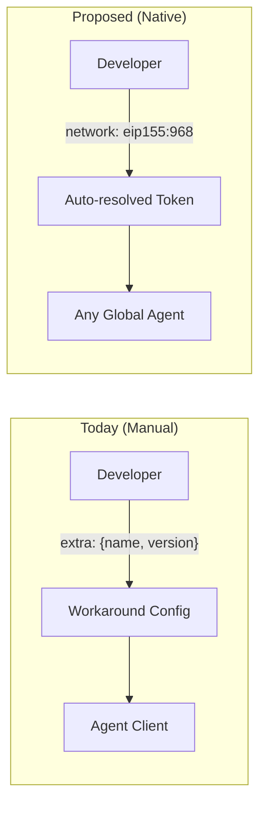
```mermaid
graph LR
    subgraph "Today (Manual)"
        DEV1["Developer"] -->|"extra: {name, version}"| HACK["Workaround Config"]
        HACK --> AGENT1["Agent Client"]
    end

    subgraph "Proposed (Native)"
        DEV2["Developer"] -->|"network: eip155:968"| AUTO["Auto-resolved Token"]
        AUTO --> AGENT2["Any Global Agent"]
    end
```

### Action 2: Self-Hosted BOT Chain Facilitator

Deploy a BOT Chain-native facilitator service that:
- Verifies EIP-712 signatures against `eip155:968`
- Submits `permit()` + `transferFrom()` settlements to BOT Chain
- Supports batch/deferred settlement for high-frequency agents
- Integrates with AIDID for agent identity verification

### Action 3: Official Developer Documentation

Add an **"AI Agent Payments"** section to BOT Chain developer docs covering:
- x402 protocol overview and why it matters for agents
- Step-by-step provider and client setup (this document)
- MockUSDC deployment and faucet usage
- MCP tool monetization patterns
- BotTrace integration for verifiable agent receipts

---

## 14. Roadmap & Future Work

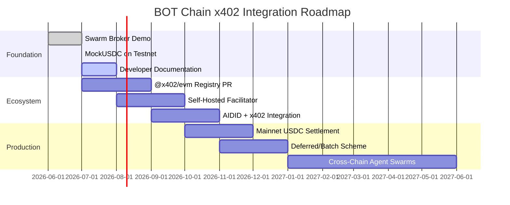
```mermaid
gantt
    title BOT Chain x402 Integration Roadmap
    dateFormat YYYY-MM
    section Foundation
        Swarm Broker Demo           :done, 2026-06, 2026-07
        MockUSDC on Testnet         :done, 2026-07, 2026-07
        Developer Documentation     :active, 2026-07, 2026-08
    section Ecosystem
        @x402/evm Registry PR       :2026-07, 2026-09
        Self-Hosted Facilitator     :2026-08, 2026-10
        AIDID + x402 Integration    :2026-09, 2026-11
    section Production
        Mainnet USDC Settlement     :2026-10, 2026-12
        Deferred/Batch Scheme       :2026-11, 2027-01
        Cross-Chain Agent Swarms    :2027-01, 2027-06
```

| Phase | Milestone | Status |
|-------|-----------|--------|
| **Phase 1** | Swarm Broker reference implementation | ✅ Complete |
| **Phase 1** | MockUSDC deployed on testnet | ✅ Complete |
| **Phase 1** | Developer documentation | 🔄 In Progress |
| **Phase 2** | `@x402/evm` native BOT Chain registration | 📋 Proposed |
| **Phase 2** | Self-hosted BOT Chain facilitator | 📋 Planned |
| **Phase 2** | AIDID identity verification in payment flow | 📋 Planned |
| **Phase 3** | Mainnet USDC settlement | 📋 Planned |
| **Phase 3** | Deferred/batch payment scheme for HFT agents | 📋 Planned |
| **Phase 3** | Cross-chain agent swarms (EVM + Solana via x402) | 📋 Planned |

---

## 15. Resources & Links

### Protocol & Standards

| Resource | URL |
|----------|-----|
| x402 Official Site | https://www.x402.org |
| x402 Whitepaper | https://www.x402.org/x402-whitepaper.pdf |
| Coinbase x402 Docs | https://docs.cdp.coinbase.com/x402/welcome |
| x402 GitHub (Foundation) | https://github.com/x402-foundation/x402 |
| EIP-712 Typed Data | https://eips.ethereum.org/EIPS/eip-712 |
| EIP-2612 Permit | https://eips.ethereum.org/EIPS/eip-2612 |
| CAIP-2 Chain IDs | https://github.com/ChainAgnostic/CAIPs/blob/master/CAIPs/caip-2.md |

### BOT Chain

| Resource | URL |
|----------|-----|
| BOT Chain Website | https://www.botchain.ai/ |
| BOT Chain Testnet RPC | https://rpc.bohr.life |
| BOT Chain Explorer | https://scan.bohr.life |
| BOT Chain Testnet Faucet | https://faucet.botchain.ai/basic |

### npm Packages

| Package | Purpose |
|---------|---------|
| `@x402/core` | Protocol engine (client, server, facilitator) |
| `@x402/evm` | EVM/Ethereum payment scheme |
| `@x402/express` | Express.js server middleware |
| `@x402/axios` | Axios client interceptor |
| `@x402/fetch` | Fetch API wrapper |
| `@x402/hono` | Hono framework middleware |
| `@x402/svm` | Solana payment scheme |

### This Repository

```bash
git clone <repo-url>
cd swarm
pnpm install
cp .env.example .env
pnpm provider:dev   # Terminal 1
pnpm agent:run      # Terminal 2
pnpm frontend:dev   # Terminal 3
```

Open `http://localhost:5173` to watch the live x402 payment flow between agent and provider.

---

<p align="center">
  <strong>BOT Chain + x402 = The Payment Layer for the Swarm Economy</strong><br/>
  <em>Autonomous agents. Instant micropayments. Zero friction.</em>
</p>
