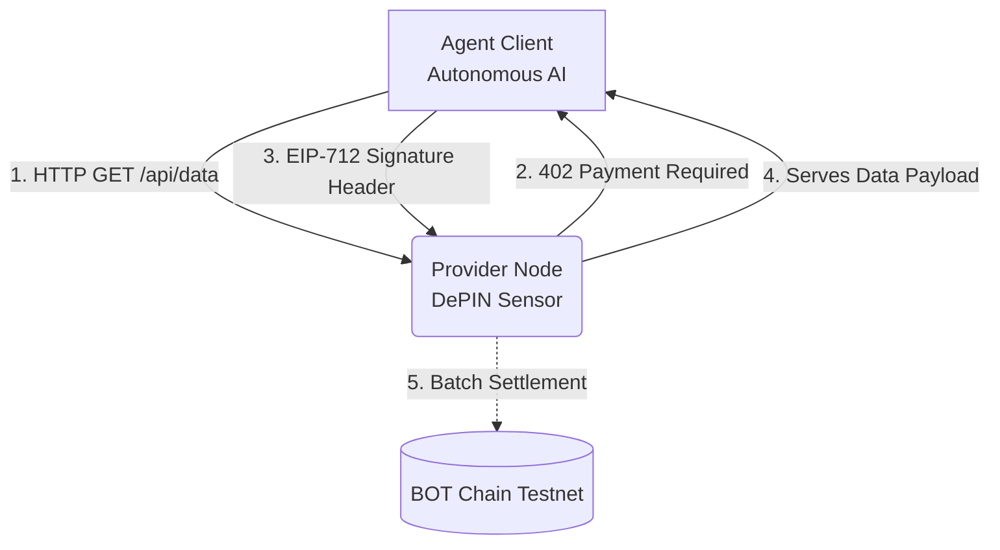

<div align="center">
  <h1>Swarm Broker</h1>
  <p><strong>The Machine-to-Machine (M2M) Economy for Autonomous AI Agents</strong></p>
  
  [](https://scan.bohr.life)
  [-blue?style=for-the-badge)](https://github.com/x402-foundation/x402)
  [](#)
</div>

<br/>

## The Problem: AI Agents Are Trapped
We are building highly advanced autonomous AI agents, but forcing them to use human payment rails. If an AI agent wants to fetch premium weather data, rent GPU compute, or hire another AI agent, it hits a paywall.
* Stripe blocks automated bots.
* API keys require human credit cards.
* Standard crypto payments (Approve + Transfer) require two slow, expensive on-chain transactions.

## The Solution: Swarm Broker
**Swarm Broker** is a full-stack infrastructure that gives AI agents their own wallets and allows them to autonomously negotiate, sign, and pay for APIs using the **x402 (HTTP 402 Payment Required)** protocol. 

By utilizing **BOT Chain's** lightning-fast EVM and **EIP-2612 (ERC20Permit)** gasless signatures, agents can negotiate micro-fees off-chain at 10,000+ TPS and settle instantly. Zero human interaction required ;)

---

## Live On-Chain Deployment (BOT Chain Testnet)

We deployed a custom `ERC20Permit` stablecoin to the BOT Chain Testnet to facilitate the gasless agent economy. 

| Resource | Data |
|----------|------|
| **Network** | BOT Chain Testnet (Chain ID: `968`) |
| **RPC URL** | `https://rpc.bohr.life` |
| **Explorer** | [BOT Chain Scan](https://scan.bohr.life) |
| **Agent Settlement Token (MockUSDC)** | [`0x0a787b1BDeD316ff833113be958Dcd1dF9654940`](https://scan.bohr.life/address/0x0a787b1BDeD316ff833113be958Dcd1dF9654940) |
| **Master Agent Wallet** | `0x18AF72239dD6a52426e4dd9509C6515Df06477E4` |

---

## Architecture

The monorepo is split into three interconnected microservices that form a closed-loop economy:



1. **`apps/contracts`**: Contains the custom `MockUSDC.sol` which implements `ERC20Permit` for gasless, off-chain EIP-712 signatures.
2. **`apps/provider-node`**: An Express API gating premium market data behind an x402 paywall. It intercepts requests, demands 0.01 USDC, and mathematically verifies incoming agent signatures.
3. **`apps/agent-client`**: A Node.js daemon acting as the autonomous AI. It detects 402 challenges, cryptographically signs payments with its private key, and streams data.
4. **`apps/frontend`**: A stunning React dashboard built with Framer Motion that visualizes the WebSocket chatter between the Agent and Provider in real-time.

---

## Quick Start & Testing Guide

Want to watch an AI agent autonomously negotiate and pay for data in real-time? Follow these steps:

### 1. Install Dependencies
```bash
git clone https://github.com/rythmern02/Swarm-Broker.git
cd Swarm-Broker
pnpm install
```

### 2. Configure Environment
Copy the example environment file and add your private key.
```bash
cp .env.example .env
# Edit .env with your Agent/Provider Private Key
```

### 3. Launch the Swarm (Run in 3 separate terminals)

**Terminal 1: Start the Provider Node (The DePIN API)**
```bash
pnpm provider:dev
# Starts the server on port 4402 and the WebSocket broadcaster
```

**Terminal 2: Start the Agent Client (The Autonomous Buyer)**
```bash
pnpm agent:run
# The agent will ping the provider every 10 seconds, get rejected (402), 
# sign an EIP-712 payload, and successfully fetch the data!
```

**Terminal 3: Start the Visualizer Dashboard**
```bash
pnpm frontend:dev
# Open localhost:5173 to watch the real-time cryptographic negotiation :)
```

---

## Hackathon Notes (BOT Chain Builder Challenge #1)
This project was built for the **BOT Chain Builder Challenge #1**. 
* **Track:** AI Agent
* **Core Tech:** BOT Chain EVM, x402 Protocol, EIP-712, ERC20Permit.
* **Proposal:** We have also submitted a comprehensive ecosystem proposal to natively integrate x402 into BOT Chain. Read the technical spec here: [BOT_CHAIN_X402_PROPOSAL.md](./BOT_CHAIN_X402_PROPOSAL.md)

---
<div align="center">
  <i>Built for the Machine-to-Machine future.</i>
</div>
